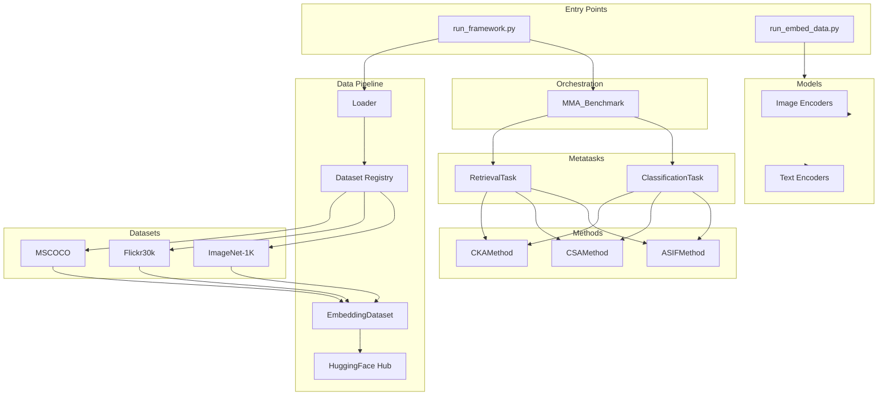

# MMA Benchmark — Multimodal Alignment Benchmark

> A modular, extensible Python framework for benchmarking **training-free multimodal alignment methods** across classification and retrieval tasks. It evaluates how well independently trained unimodal encoders (image + text) can be aligned without joint training, using methods like **ASIF**, **CSA (CCA-Based Alignment)**, and **CKA (Centered Kernel Alignment)**.

---

## Table of Contents

- [Architecture Overview](#architecture-overview)
- [Project Structure](#project-structure)
- [Core Concepts](#core-concepts)
  - [Abstract Base Classes](#abstract-base-classes)
  - [Registry Pattern](#registry-pattern)
- [Modules](#modules)
  - [Benchmark Orchestrator](#benchmark-orchestrator)
  - [Data Pipeline](#data-pipeline)
  - [Datasets](#datasets)
  - [Metatasks](#metatasks)
  - [Alignment Methods](#alignment-methods)
  - [Embedding Models](#embedding-models)
- [Configuration](#configuration)
- [Usage](#usage)
  - [Running the Benchmark](#running-the-benchmark)
  - [Generating Embeddings](#generating-embeddings)
- [Extending the Framework](#extending-the-framework)
  - [Adding a New Dataset](#adding-a-new-dataset)
  - [Adding a New Alignment Method](#adding-a-new-alignment-method)
  - [Adding a New Embedding Model](#adding-a-new-embedding-model)
- [Dependencies](#dependencies)

---

## Architecture Overview



---

## Project Structure

```
Alignment_Benchmark/
├── base/
│   └── base.py                  # Abstract base classes (AbsTask, AbsModel, AbsMethod)
├── benchmark.py                 # MMA_Benchmark orchestrator
├── config.py                    # Central configuration dictionary
├── data/
│   ├── __init__.py              # Dataset registry & get_dataset_class()
│   ├── dataset_base.py          # DatasetBase & EmbeddingDataset base classes
│   ├── dataset_utils.py         # HuggingFace embedding loading/uploading utilities
│   ├── embed_data.py            # Generic embed_images() / embed_text() helpers
│   ├── get_data_embedding.py    # End-to-end embedding generation pipeline
│   └── loader.py                # load_dataset_metatask() — wires datasets to metatasks
├── datasets/
│   ├── flickr30k/
│   │   └── flickr30k_retrieval_dataset.py
│   ├── imagenet1k/
│   │   └── imagenet1k_zeroshot_classif_dataset.py
│   └── mscoco/
│       └── mscoco_multilabel_classification_dataset.py
├── metatasks/
│   ├── __init__.py              # Metatask registry & factory functions
│   ├── classification.py        # ClassificationTask (zero-shot classification)
│   └── retrieval.py             # RetrievalTask (image-text retrieval)
├── methods/
│   ├── __init__.py              # Method registry
│   ├── asif.py                  # ASIF alignment method
│   ├── asif_core.py             # ASIF core: relative_represent, sparsify, normalize_sparse
│   ├── csa.py                   # CSA (CCA-based) alignment method
│   ├── csa_core.py              # NormalizedCCA implementation
│   ├── cka.py                   # CKA alignment method
│   └── cka_core.py              # CKA core: HSIC, kernel/linear CKA, matching algorithms
├── models/
│   ├── __init__.py              # Model registries (image & text)
│   ├── model.py                 # Concrete encoder functions (DINOv2, ViT, GTR-T5, etc.)
│   ├── model_wrappers.py        # HFModelWrapper for generic HuggingFace models
│   └── models_utils.py          # ViT implementation, image processors, weight loaders
├── run_framework.py             # Main entry point to run the benchmark
└── run_embed_data.py            # Entry point to generate & upload embeddings
```

---

## Core Concepts

### Abstract Base Classes

All pluggable components inherit from abstract interfaces defined in `base/base.py`:

| Class | Purpose | Key Abstract Methods |
|-------|---------|---------------------|
| `AbsTask` | Defines an evaluation task | `run(method, model, **kwargs) → Dict` |
| `AbsModel` | Defines a multimodal encoder | `encode_image(images) → ndarray`, `encode_text(text) → ndarray` |
| `AbsMethod` | Defines an alignment method | `align(query_embeddings, support_embeddings, **kwargs) → ndarray` |

### Registry Pattern

The framework uses a **registry pattern** across all major subsystems for plug-and-play extensibility:

| Registry | Location | Lookup Function |
|----------|----------|-----------------|
| Datasets | `data/__init__.py` | `get_dataset_class(name)` |
| Metatasks | `metatasks/__init__.py` | `get_metatask(name)` |
| Methods | `methods/__init__.py` | `get_method_class(name)` |
| Image Models | `models/__init__.py` | `get_image_embedding_model(name)` |
| Text Models | `models/__init__.py` | `get_text_embedding_model(name)` |

Each registry maps string keys to classes/callables. Use the corresponding `list_*()` function to see available entries.

---

## Modules

### Benchmark Orchestrator

**File:** `benchmark.py`

`MMA_Benchmark` orchestrates evaluation across multiple tasks:

```python
class MMA_Benchmark:
    def __init__(self, tasks: List[AbsTask])
    def run(self, method: AbsMethod, model: AbsModel, support_embeddings=None, **kwargs) -> Dict[str, Dict[str, Any]]
    def add_task(self, task: AbsTask)
```

It iterates over all registered tasks and calls `task.run(method, ...)`, collecting results by task name.

---

### Data Pipeline

#### `DatasetBase` (`data/dataset_base.py`)

Base class for raw dataset loading. Subclasses implement `load_data()` to parse image paths, captions, and labels.

#### `EmbeddingDataset` (`data/dataset_base.py`)

Companion base class for datasets that use pre-computed embeddings. Provides:

| Method | Description |
|--------|-------------|
| `load_two_encoder_data(repo_id, img_name, text_name)` | Loads image & text embeddings from HuggingFace Hub |
| `set_train_test_split_index(ratio, seed)` | Creates reproducible train/test splits |
| `set_training_paired_embeddings()` | Builds aligned `(image, text)` pairs for training — *abstract, subclass-specific* |
| `get_support_embeddings()` | Returns the `support_embeddings` dict (`train_image`, `train_text`, optionally `labels_emb`) |
| `get_test_data()` | Returns test split data — *abstract, subclass-specific* |

#### `dataset_utils.py`

Utility functions for embedding I/O:

| Function | Description |
|----------|-------------|
| `load_embeddings_from_hf(file, repo_id)` | Downloads & caches embeddings from HuggingFace Hub |
| `validate_embeddings(embeddings, dims, min_samples)` | Validates array shape and type |
| `upload_embeddings_to_hf(embeddings, path, api, repo_id, path_in_repo)` | Saves & uploads embeddings to HuggingFace |
| `clear_embedding_cache()` | Clears the in-memory embedding cache |

#### `loader.py`

Bridges datasets and metatasks:

```python
def load_dataset_metatask(dataset_name: str, config: DictConfig) -> AbsTask
```

1. Looks up the dataset class from the registry
2. Instantiates it with the task config
3. Wraps it into the appropriate `ClassificationTask` or `RetrievalTask`

#### `get_data_embedding.py`

End-to-end embedding generation pipeline. For each dataset:
1. Instantiates the dataset in embedding-generation mode (`generate_embedding: True`)
2. Encodes images and/or text using the configured encoders
3. Uploads the resulting embeddings to HuggingFace Hub

---

### Datasets

All datasets implement both `DatasetBase` (for raw data) and `EmbeddingDataset` (for precomputed embeddings) through multiple inheritance.

#### ImageNet-1K (`datasets/imagenet1k/`)

- **Task type:** Zero-shot classification
- **Classes:** `Imagenet1k` → `Imagenet1kZeroshotClassificationDataset`
- **Data source:** Local ImageNet validation set + synset mappings
- **Labels:** 1000 ImageNet classes with text descriptions (`"This is an image of {class}"`)
- **Support embeddings:** Paired `(image_embedding, label_embedding)` per training sample

#### Flickr30k (`datasets/flickr30k/`)

- **Task type:** Image-text retrieval
- **Classes:** `Flickr30k` → `Flickr30kRetrievalDataset`
- **Data source:** Flickr30k dataset with `captions.txt`
- **Captions:** 5 captions per image
- **Ground truth:** Maps images ↔ captions by position index

#### MSCOCO (`datasets/mscoco/`)

- **Task types:** Multi-label classification AND retrieval
- **Classes:** `MScoco` → `MScocoMultiLabelClassificationDataset`, `MScocoRetrievalDataset`
- **Data source:** COCO train2017 with annotations JSONs
- **Labels:** 80 object categories; 5 captions per image for retrieval

---

### Metatasks

Metatasks define how evaluation is performed on a dataset + alignment method combination.

#### ClassificationTask (`metatasks/classification.py`)

Zero-shot classification flow:

1. If the method has a `classify()` method → call it directly
2. Otherwise → call `method.align()` to project embeddings, then compute cosine similarity against all label embeddings
3. Predictions = `argmax` of similarity scores
4. **Metric:** Accuracy (via `sklearn.metrics.accuracy_score`)

#### RetrievalTask (`metatasks/retrieval.py`)

Image-text retrieval flow:

1. If the method has a `retrieve()` method → call it directly
2. Otherwise → call `method.align()`, then compute pairwise similarity, return top-K
3. **Metrics:** P@1, P@5 (Precision at K)

---

### Alignment Methods

#### ASIF — Anchored Sparse Implicit Features (`methods/asif.py`)

Based on the paper: *"ASIF: Coupled Data Turns Unimodal Models to Multimodal Without Training"* ([OpenReview](https://openreview.net/pdf?id=YAxV_Krcdjm)).

**How it works:**
- Uses paired anchor embeddings (support set) to create a **relative representation** via sparse decomposition
- Test image/text embeddings are projected into a shared sparse space using the anchors
- Similarity is computed via sparse dot products in this relative space

**Key parameters:**

| Parameter | Default | Description |
|-----------|---------|-------------|
| `non_zeros` | 800 | Number of non-zero entries in the sparse representation |
| `val_exps` | `[8.0]` | Similarity exponents to test |
| `max_gpu_mem_gb` | 8.0 | Maximum GPU memory budget |

**Core functions** (`asif_core.py`):
- `relative_represent(y, basis, non_zeros)` — Sparse decomposition via top-K inner products
- `sparsify(indices, values, size)` — Creates sparse COO tensors
- `normalize_sparse(tensor, nnz_per_row)` — Row-wise normalization

**Provides:** `classify()`, `retrieve()`, `similarity_function()`

---

#### CSA — CCA-based Spectral Alignment (`methods/csa.py`)

Uses Canonical Correlation Analysis (CCA) to learn a shared linear subspace.

**How it works:**
1. **Fit:** Learn CCA projections from paired support embeddings (zero-meaned)
2. **Transform:** Project test image and text embeddings into the CCA space
3. **Similarity:** Weighted correlation using learned canonical correlations

**Key parameters:**

| Parameter | Default | Description |
|-----------|---------|-------------|
| `sim_dim` | 512 | Number of CCA dimensions to retain |

**Core class** (`csa_core.py`): `NormalizedCCA`
- `fit_transform_train_data(data1, data2)` — Fits CCA and stores projections + correlation coefficients
- `transform_data(data1, data2)` — Projects new data using the fitted model
- `save_model(path)` / `load_model(path)` — Persistence via pickle/joblib

**Provides:** `align()`, `similarity_function()`, `get_similarity_function()`

---

#### CKA — Centered Kernel Alignment (`methods/cka.py`)

Uses local CKA to build a similarity graph between query pairs.

**How it works:**
1. Samples base and query points from support/test embeddings
2. For each (source_query, target_query) pair, computes local CKA by appending each to the base set
3. Builds an N×N similarity graph
4. **Retrieval:** Checks if the diagonal (correct match) appears in top-K
5. **Classification:** Solves a linear assignment problem on the graph

**Key parameters:**

| Parameter | Default | Description |
|-----------|---------|-------------|
| `base_samples` | 100 | Number of base (anchor) samples |
| `query_samples` | 100 | Number of query samples |
| `clustering_mode` | 0 | Sampling strategy: `0`=random, `1`=source clustering, `2`=target clustering |
| `graph_func` | `linear_local_CKA` | Kernel function: also `kernel_local_CKA`, `linear_baseline`, `cos_baseline`, `relative_baseline` |

**Core functions** (`cka_core.py`):
- `linear_CKA(X, Y)` / `kernel_CKA(X, Y)` — Global CKA functions
- `linear_local_CKA(...)` / `kernel_local_CKA(...)` — Local CKA per query pair
- `linear_matching(...)` / `qap_matching(...)` — Matching algorithms for classification
- `get_retrieval(graph)` — Top-1/5/10 retrieval accuracy
- `get_data_sep(...)` — Sampling and optional stretching of representations

**Provides:** `align()`, `classify()`, `retrieve()`

---

### Embedding Models

#### Image Encoders (`models/model.py`)

| Registry Key | Model | Variants |
|-------------|-------|----------|
| `dinov2` | Facebook DINOv2 | `dinov2-giant`, `dinov2-large`, `dinov2-base`, `dinov2-small` |
| `dinov3` | Facebook DINOv3 | `dinov3-vit7b16-pretrain-lvd1689m`, and others |
| `google_vit` | Google ViT | `vit-large-patch32-384`, `vit-base-patch32-384` |
| `ibot` | iBOT (self-supervised ViT) | `ibot-base`, `ibot-large` |
| `infloat_e5` | Intfloat E5 | `e5-small-v2`, `e5-base-v2`, `e5-large-v2` |

Additional models available in code but not in registry: `cosplace_img`, `dinov1_vitb16`, `ijepa`.

#### Text Encoders (`models/model.py`)

| Registry Key | Model | Variants |
|-------------|-------|----------|
| `sentence_t5` | Sentence-T5 | `sentence-t5-xxl`, `sentence-t5-xl`, `sentence-t5-large`, `sentence-t5-base` |
| `gtr_t5` | GTR-T5 | `gtr-t5-xxl`, `gtr-t5-xl`, `gtr-t5-large`, `gtr-t5-base` |
| `all_mpnet_base_v2` | All-MpNet-Base-v2 | — |
| `alibaba_gte_en_v1_5` | Alibaba GTE | `gte-base-en-v1.5`, `gte-large-en-v1.5` |
| `baai_bge_en_v1_5` | BAAI BGE | `bge-base-en-v1.5`, `bge-large-en-v1.5` |

Additional models in code: `gte_qwen2_1_5B_instruct`.

#### HFModelWrapper (`models/model_wrappers.py`)

A generic wrapper implementing `AbsModel` for any HuggingFace model with both tokenizer and image processor support.

---

## Configuration

All configuration is centralized in `config.py` as a Python dictionary, converted to an `OmegaConf` `DictConfig` at runtime.

```python
config = {
    # Tasks to run (dataset names)
    "tasks": ["imagenet1k", "flickr30k"],

    # Methods to evaluate
    "methods": ["asif", "csa"],

    # Method-specific parameters
    "csa": { "sim_dim": 700 },
    "asif": { "non_zeros": 800 },

    # Metatask-specific parameters
    "retrieval": { "topk": 10, "num_gt": 5 },
    "classification": {},

    # Optional: override support embeddings
    "support_embeddings": None,

    # Per-dataset configuration
    "imagenet1k": {
        "root": "/path/to/ImageNet/val",
        "loc_val_solution": "/path/to/LOC_val_solution.csv",
        "loc_synset_mapping": "/path/to/LOC_synset_mapping.txt",
        "hf_img_embedding_name": "ImageNet_img_embed_dinov2-giant.pkl",
        "hf_text_embedding_name": "ImageNet_text_embed_gtr-t5-large.pkl",
        "hf_repo_id": "ridalefdali/ImageNet_embeddings",
        "train_test_ratio": 0.7,
        "seed": 42,
        "split": "large",
        "generate_embedding": False,
        "metatask": "classification",
    },
    "flickr30k": {
        "dataset_path": "/path/to/flickr30k",
        "hf_img_embedding_name": "flickr30k_dinov2_dinov2-large_image_embeddings.pkl",
        "hf_text_embedding_name": "flickr30k_gtr_t5_gtr-t5-xl_text_embeddings.pkl",
        "hf_repo_id": "ridalefdali/flickr30k_embeddings",
        "train_test_ratio": 0.7,
        "seed": 42,
        "split": "large",
        "num_caption_per_image": 5,
        "num_image_per_caption": 1,
        "generate_embedding": False,
        "metatask": "retrieval",
    },

    # Embedding model configuration (for generating embeddings)
    "embedding_model": {
        "img_encoder": "dinov2",
        "text_encoder": "gtr_t5",
        "image_model_variant": "dinov2-large",
        "text_model_variant": "gtr-t5-xl",
        "batch_size": 50,
    }
}
```

### Key Configuration Fields

| Field | Scope | Description |
|-------|-------|-------------|
| `tasks` | Global | List of dataset names to benchmark |
| `methods` | Global | List of alignment methods to evaluate |
| `train_test_ratio` | Per-dataset | Fraction of data used for support set |
| `seed` | Per-dataset | Random seed for reproducible splits |
| `split` | Per-dataset | `"large"` (auto-split), `"train"`, or `"val"` |
| `generate_embedding` | Per-dataset | `True` to generate embeddings, `False` to load precomputed |
| `metatask` | Per-dataset | `"classification"` or `"retrieval"` |
| `hf_repo_id` | Per-dataset | HuggingFace repository for precomputed embeddings |

---

## Usage

### Running the Benchmark

```bash
python run_framework.py
```

**Pipeline flow:**

1. Reads `config.py`
2. For each task in `config.tasks`:
   - Loads the dataset + wraps it in the corresponding metatask
3. Creates `MMA_Benchmark(tasks)`
4. For each method in `config.methods`:
   - Instantiates the method with its config parameters
   - Calls `benchmark.run(method=method, model=None, support_embeddings=...)`
5. Prints results per method

### Generating Embeddings

```bash
python run_embed_data.py
```

For each task in `config.tasks`, with `generate_embedding: True`:
1. Loads the raw dataset (image paths / text descriptions)
2. Encodes images using the configured image encoder
3. Encodes text (captions or label descriptions) using the configured text encoder
4. Uploads both embedding files to the specified HuggingFace repository

---

## Extending the Framework

### Adding a New Dataset

1. **Create the dataset class** inheriting from `DatasetBase` and `EmbeddingDataset`:

```python
# datasets/my_dataset/my_dataset.py
from data.dataset_base import DatasetBase, EmbeddingDataset

class MyRawDataset(DatasetBase):
    def __init__(self, data_path):
        super().__init__()
        self.load_data(data_path)

    def load_data(self, data_path):
        # Load image paths, captions/labels, etc.
        ...

class MyDataset(MyRawDataset, EmbeddingDataset):
    def __init__(self, task_config):
        MyRawDataset.__init__(self, task_config.data_path)
        EmbeddingDataset.__init__(self, split=task_config.split)
        # Load embeddings, set splits, build support pairs
        ...

    def set_training_paired_embeddings(self):
        # Build self.support_embeddings["train_image"] and ["train_text"]
        ...

    def get_test_data(self):
        # Return test split data
        ...
```

2. **Register it** in `data/__init__.py`:

```python
from datasets.my_dataset.my_dataset import MyDataset

_DATASET_REGISTRY["my_dataset-classification"] = MyDataset
```

3. **Add config** in `config.py`:

```python
"my_dataset": {
    "data_path": "/path/to/data",
    "hf_repo_id": "...",
    "metatask": "classification",
    ...
}
```

---

### Adding a New Alignment Method

1. **Create the method class** inheriting from `AbsMethod`:

```python
# methods/my_method.py
from base.base import AbsMethod

class MyMethod(AbsMethod):
    def __init__(self, param1=10):
        super().__init__("MyMethod")
        self.param1 = param1

    def align(self, image_embeddings, text_embeddings, support_embeddings, **kwargs):
        # Return (aligned_images, aligned_texts)
        ...

    # Optionally override classify() and retrieve() for task-specific logic
```

2. **Register it** in `methods/__init__.py`:

```python
from .my_method import MyMethod

_METHOD_REGISTRY["my_method"] = MyMethod
```

3. **Add config** in `config.py`:

```python
"methods": ["asif", "csa", "my_method"],
"my_method": { "param1": 10 },
```

---

### Adding a New Embedding Model

1. **Create the encoder function** in `models/model.py`:

```python
def my_encoder(inputs: list, batch_size: int = 50, model_variant=None) -> np.ndarray:
    # Load model, process inputs, return (embeddings, total_params)
    ...
```

2. **Register it** in `models/__init__.py`:

```python
_IMAGE_EMBEDDING_MODEL_REGISTRY["my_encoder"] = my_encoder
# or
_TEXT_EMBEDDING_MODEL_REGISTRY["my_encoder"] = my_encoder
```

---

## Dependencies

| Package | Purpose |
|---------|---------|
| `numpy` | Array operations |
| `torch` | GPU computation, sparse tensors (ASIF/CKA) |
| `transformers` | HuggingFace model loading |
| `sentence-transformers` | Text encoder models |
| `huggingface_hub` | Downloading/uploading embeddings |
| `scikit-learn` | Metrics (accuracy), CCA, clustering, linear regression |
| `cca_zoo` | CCA implementation for CSA method |
| `omegaconf` | Configuration management |
| `polars` | Fast DataFrame operations for dataset loading |
| `scipy` | Linear & quadratic assignment (CKA matching) |
| `PIL` (Pillow) | Image loading |
| `tqdm` | Progress bars |
| `joblib` | Model serialization |
